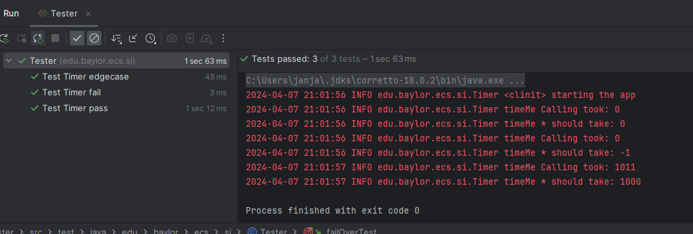
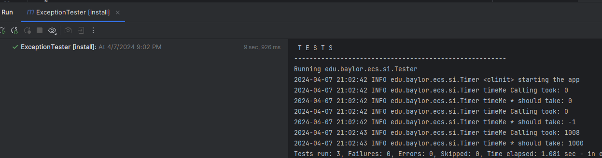

1. It has different logging levels, as well as log info to output. This tells us what the "log" is about, whther it is information or a warning log. It can also tell us when we have bad errors, such as the SEVERE level. It also act as the place where files are written.
2. This line comes from logger.log
3. Assertions.assertThrows asserts that an exception will be thrown, so that the testing knows that is the output expected rather than an error.
4. See TimerException and there are 3 questions

   1. This is to guarantee that a consistent serialVersionUID value is used across different Java compiler implementations, as a standard sereialVersionUID is constructed based off of multiple factors, and can be calculated differently across different versions. This is used to verify that the sender and receiver have valid classes that can be used.
   2. We need to override the constructors as we need different types of constructors. The default override would be to have the exception  constructor as a default. The second constructor would be used for within try statements, and would be used for warnings in a sense. The last one has a exception parameter, in order to catch and print.
   3. We did not override other exception methods as it isn't required for our JUnit tests.
5. It acts as a set of instructions that is ran once, when a class is loaded into memory. It's basically an initial action that occurs once.
6. It is used to write decriptions, tables, links, images, etc onto a file that can be displayed. It works as a simple simple simple HTML almost.
7. The test is failing since timeNow in timeMe() is initialized as null. The tester also assertThrows, saying that it is expecting a exception to be thrown.
8. An exception is being thrown since a value of less than 0 is being inputted, which is caught and descripted as a sleep exception. This signifies that the sleep time was not valid. Finally, the info on how long it should've taken is outputted.
9. Make a printScreen of your eclipse JUnit5 plugin run (JUnit window at the bottom panel)

   
10. Make a printScreen of your eclipse Maven test run, with console

    
11. They are runtime exceptions.
12. Push the updated/fixed source code to your own repository.
